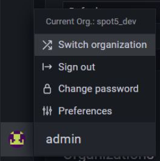

#miniit #snipe #log #debug #grafana 

Серверные логи досупны по адресу:
[`https://dev.snipe.dev/grafana/`](https://dev.snipe.dev/grafana/)

Каждое сообщение, которое клиент присылает на сервер, его ответ и много другой информации идет в серверные логи. Самое главное, что в случае серверных действий и операций над логикой в серверные логи идет дифф изменений профиля игрока, чтобы не оставалось сомнений о том, что произошло. Их можно посмотреть через Графану, используя логин и пароль для серверного редактора. Для каждого проекта дашборды одинаковы, но находятся в разных организациях (у DEV и LIVE версий проекта свои организации). Поэтому если вы работаете над несколькими проектами одновременно или только что перешли на другой проект, понадобится выбрать корректную организацию в Графане. Сменить организацию можно, наведя на свою иконку в нижнем левом углу и выбрав в выпадающем списке Switch organization:

Внутри проекта есть несколько дашбордов с логами. Полный список можно получить, нажав сверху на слова "General / Home". Далее надо выбирать один из следующих пунктов (имя проекта для примера):

1. spot5_dev/Logs Elastic (Logs) - логи списком, сортировка всегда по дате от текущей вниз
2. spot5_dev/Logs Elastic (Table) - логи в таблице, сортировка по любому полю в любую сторону
3. spot5_dev/Logs Elastic ConnectionID (Table) - логи конкретной сессии, аналогично логам 2 с введенным “connectionID:12345”
4. spot5_dev/Logs Elastic UserID (Table) - логи конкретного игрока, аналогично логам 2 с введенным “userID:12345”
5. spot5_dev/Client Logs Elastic (Logs) - клиентские логи (отправленные с клиента). доступны не на всех проектах
6. spot5_dev/Client Logs Elastic (Table) - аналогично, но в форме таблицы

Во всех них текстовое поле ввода поддерживает язык KQL. Ссылка на полную справку языка появляется если навести на слово KQL. Пример строчки ввода: "userID:12345 AND connectionID:1234512345". Этот запрос найдет все логи указанного игрока из конкретной сессии (на самом деле ID сессии уникален, можно искать только по нему, это для примера). Если ввести слово без префиксов, то оно будет искаться в тексте сообщения (только сообщения!) как отдельное слово. Пример поиска строки в сессии: “connectionID:1234 AND user.login”. Поиск по маске через *, например "*get*". Строчки в сообщениях часто надо искать по маске, потому что символы вокруг слова могут считаться его частью. Выбор диапазона по времени результатов стандартен для Графаны, выпадающее окно при нажатии на дату в правом верхнем углу экрана.

Если нужно, то логи можно выгружать в CSV. Эта функция спрятана так хитро, что мне даже не удается сделать скриншот. Нужно нажать на маленький треугольник у заголовка Logs, потом выбрать Inspect и далее Data.

Где в свою очередь будет кнопка Download CSV. Большие логи скорее всего взорвут вам браузер, поэтому сперва придется сократить их через время или по каким-то критериям запроса.

**Совет**

Когда вы смотрите логи игрока, связанные с игрой созданной через матчмейкинг (например Отличия, Дайс, Инстант итп), можно и нужно найти roomID в логах игрока и на отдельной странице открыть логи комнаты (Пример запроса “roomID:12345”). Это нужно поскольку далеко не всё, что происходит в комнате, пойдет в логи конкретного игрока, особенно когда в комнате их больше одного. В логе комнаты часто бывают добавочные подсказки о том, что происходило в тот или иной момент игры.
