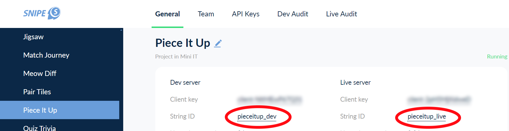

# Project ID

Посмотреть его можно в дашборде снайпа. Доступ туда есть не у всех =)
[https://dash.snipe.dev/](https://dash.snipe.dev/)

Можно спросить у PM

на примере Piece It Up



Project ID нужно указывать **без суффикса,** т.е. будет:

```csharp
const string PROJECT_ID = "pieceitup";
```