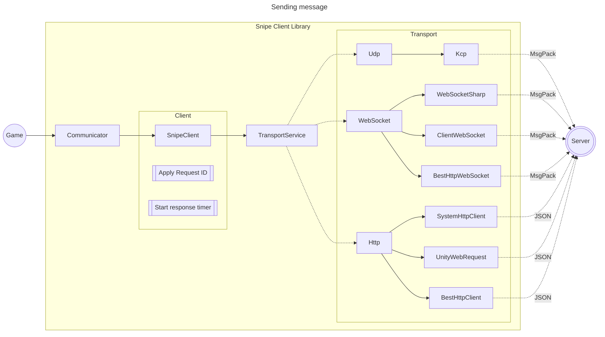
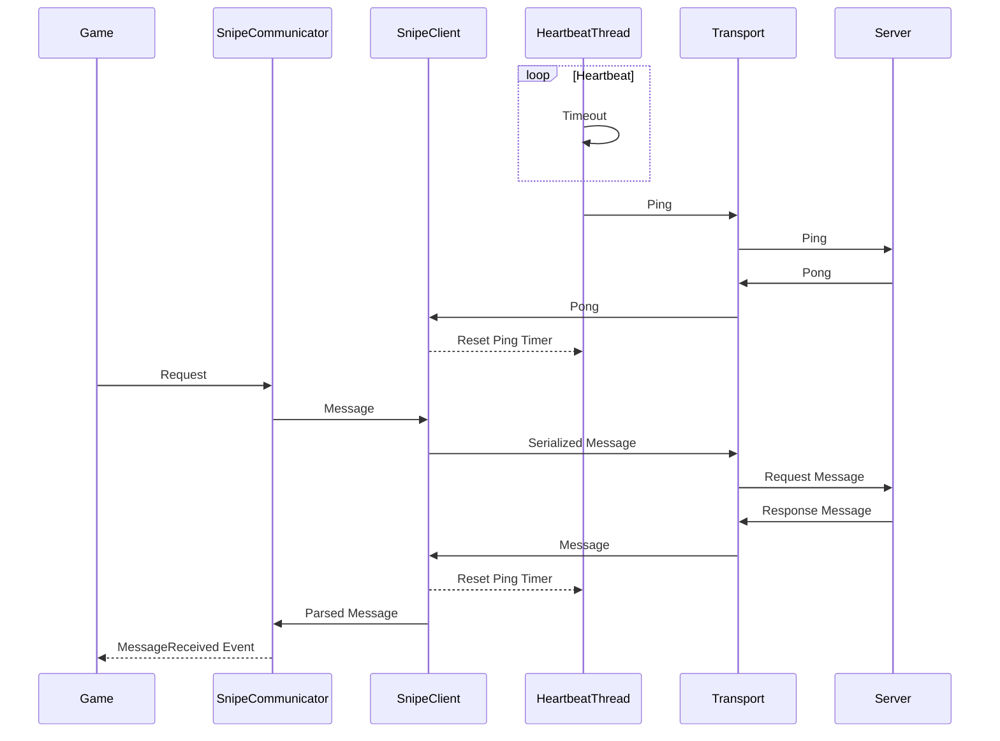

#snipe 

```mermaid  
---
title: Sending message
---
graph LR;
App((Game)) --> Communicator;
	subgraph Snipe Client Library
		Communicator --> SnipeClient;
		SnipeClient --> TransportService;
		subgraph Client
			SnipeClient;
			RID[[Apply Request ID]]
			ST[[Start response timer]];
		end
		subgraph Transport
			Udp --> Kcp
			WebSocket --> WebSocketSharp
			WebSocket --> ClientWebSocket
			WebSocket --> BestHttpWebSocket
			Http --> SystemHttpClient
			Http --> UnityWebRequest
			Http --> BestHttpClient
		end
		TransportService -.-> Udp;
		TransportService -.-> WebSocket;
		TransportService -.-> Http;
	end
Kcp -. MsgPack .-> Server(((Server)));

WebSocketSharp -. MsgPack .-> Server;
ClientWebSocket -. MsgPack .-> Server;
BestHttpWebSocket -. MsgPack .-> Server;

SystemHttpClient -. JSON .-> Server;
UnityWebRequest -. JSON .-> Server;
BestHttpClient -. JSON .-> Server;
```

```mermaid
sequenceDiagram
participant Game
participant SnipeCommunicator
participant SnipeClient
participant HeartbeatThread
participant Transport
participant Server

loop Heartbeat
	HeartbeatThread->>HeartbeatThread: Timeout
end
HeartbeatThread->>Transport: Ping
Transport->>Server: Ping
Server->>Transport: Pong
Transport->>SnipeClient: Pong
SnipeClient-->>HeartbeatThread: Reset Ping Timer

Game->>SnipeCommunicator: Request
SnipeCommunicator->>SnipeClient: Message
SnipeClient->>Transport: Serialized Message
Transport->>Server: Request Message
Server->>Transport: Response Message
Transport->>SnipeClient: Message
SnipeClient-->>HeartbeatThread: Reset Ping Timer
SnipeClient->>SnipeCommunicator: Parsed Message
SnipeCommunicator-->>Game: MessageReceived Event
```

